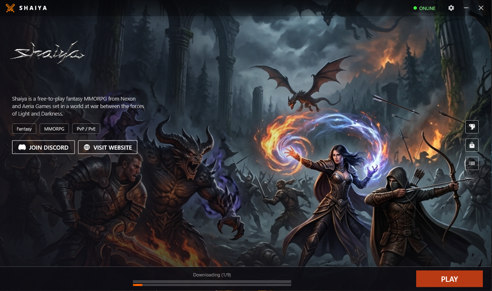
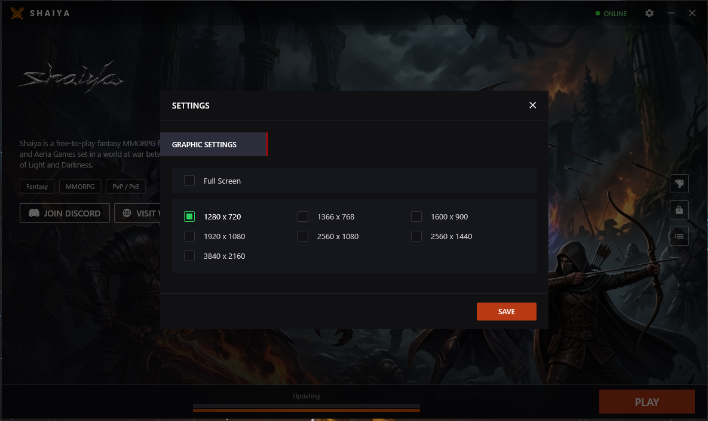

# Shaiya Updater (Teos-inspired)

**Original repository:** https://github.com/kurtekat/shaiya-updater

This is a modern, Teos-inspired UI overhaul for the Shaiya Updater. 

**Important Note:**
Everything can be edited directly in the source code. The core logic of the updater has been kept entirely untouched and only the UI has been changed to provide a high-fidelity, modern experience.

## Built-in Settings
This updater features a modern, built-in settings menu for configuring in-game resolution and fullscreen/windowed modes. You can safely remove the legacy `CONFIG.exe` utility if you no longer want it. However, you **must keep** `CONFIG.ini` in the folder, as the updater directly writes changes to this file before launching the game.

## Environment
- Windows 10
- Visual Studio 2022
- C# 12
- Windows Presentation Foundation (WPF)

## Prerequisites
- [.NET 8.0](https://dotnet.microsoft.com/en-us/download/dotnet/8.0)

## Dependencies
- [Microsoft.AspNet.WebApi.Client](https://www.nuget.org/packages/Microsoft.AspNet.WebApi.Client/)
- [Microsoft.Extensions.Configuration.Ini](https://www.nuget.org/packages/Microsoft.Extensions.Configuration.Ini/)
- [Parsec.Shaiya.Data](https://www.nuget.org/packages/Parsec.Shaiya.Data/)

## API Configuration

> **⚠️ IMPORTANT:** The `API` folder contains PHP scripts that handle authentication between the Updater and your database. These files must be deployed to your **web server** (e.g., XAMPP, IIS, or any PHP-capable host) — they should **NOT** remain on the client side.

### Setup Steps
1. Copy the `API` folder to your web server's public directory (e.g., `htdocs` in XAMPP or `wwwroot` in IIS).
2. Open `API/config.php` and update the database credentials (`$dsn`, `$dbUser`, `$dbPass`) to match your SQL Server configuration.
3. Open `Updater/appsettings.json` and change the `ApiUrl` value to point to where you hosted the API (e.g., `http://yourdomain.com/API/`).
4. Ensure your PHP environment has the `php_odbc` extension enabled (it is enabled by default in most PHP installations).

## Build

Use **Publish** instead of **Build** to output a single executable. (recommended)

## Screenshots





# Documentation

This project is designed to be like the original application. Users are expected to design the interface and develop the code to suit their needs. The source code is shared as-is, with little or no support from the author(s).

## Client Configuration

```ini
; Version.ini
[Version]
CheckVersion=3
CurrentVersion=1
```

## Server Configuration

https://github.com/kurtekat/kurtekat.github.io

### Web

```csharp
// Updater/Common/Constants.cs
public const string Source = "https://kurtekat.github.io";
public const string WebBrowserSource = "https://google.com";
```

## Patching

### Data

https://www.elitepvpers.com/forum/shaiya-private-server/1953495-tool-shaiya-make-exe-client-updater-patcher.html

https://www.elitepvpers.com/forum/shaiya-pserver-guides-releases/4937732-guide-how-delele-files-client-via-updater.html

### Updater

Assign `UpdaterVersion` and build the application.

```csharp
// Updater/Common/Constants.cs
public const uint UpdaterVersion = 2;
```

Rename the executable to `new_updater` and upload it to the expected location.

```
https://website.com/shaiya/new_updater.exe
```

Assign `UpdaterVersion` in the configuration file.

```ini
; https://website.com/shaiya/UpdateVersion.ini
[Version]
CheckVersion=3
PatchFileVersion=10
UpdaterVersion=2
```
